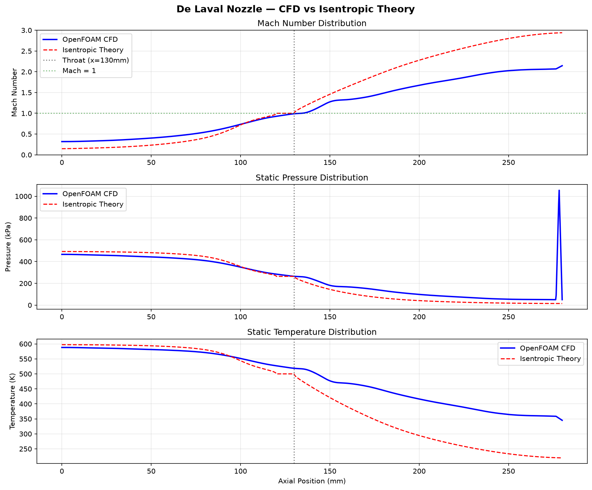

# De Laval Nozzle CFD — OpenFOAM

Simulation of compressible supersonic flow through a converging-diverging 
(De Laval) nozzle using OpenFOAM's rhoCentralFoam solver.

## Physics
- Compressible, inviscid flow
- Inlet stagnation pressure: 500 kPa
- Inlet stagnation temperature: 600 K
- Nozzle pressure ratio: 10
- Working fluid: Air (γ = 1.4)

## Results
- Throat Mach number: 0.988 (theory: 1.000) — 1.2% error
- Exit Mach number: 2.15
- Converging section MAE: 0.122

## Mesh
- Tool: OpenFOAM blockMesh
- Cells: 9,200 hexahedral
- 3-block structured mesh
- Wall-refined grading (ratio 0.25)
- Max non-orthogonality: 15.99°

## Validation
CFD results compared against isentropic flow theory analytically.



## Tools
- OpenFOAM 2406
- Python (NumPy, SciPy, Matplotlib)
- ParaView 5.11

## Run Instructions
\```bash
blockMesh
rhoCentralFoam
python3 validate_nozzle.py
\```
